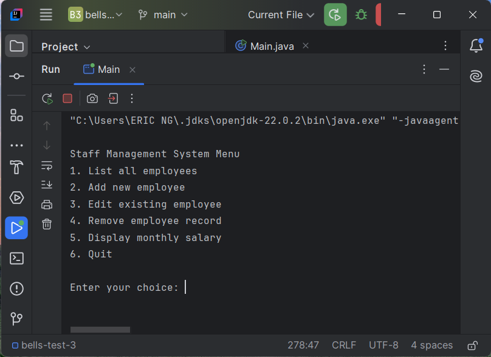
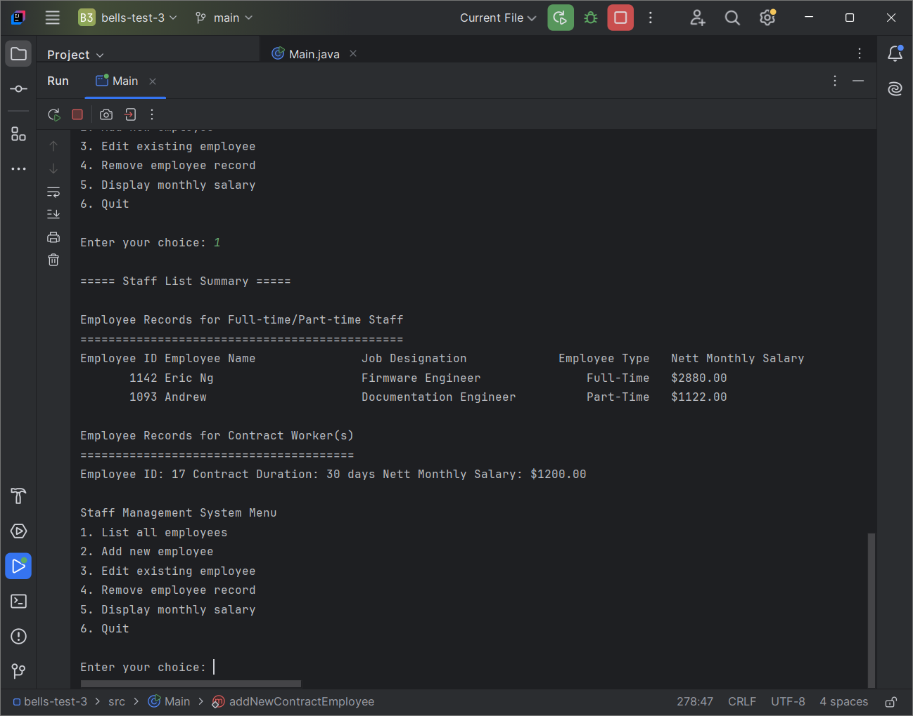

<!-- .md means markdown -->

<!-- README.md -->
<!-- This file documents the information about the portfolio project. -->
<!-- It should be READ ME first!!! -->

<!-- Heading level 1 -->
# BELLS-TEST-3
**(SCTP) Full Stack Developer**

Module 5: **Java Programming for Developers**

***Project Assignment - Portfolio***

<!-- Heading level 3 -->
### Project File Structure:

* Java Files

>>> Staff Management System  (Menu Page)
: Main.class

* src Folder (Sources Root)
: Main.java
: Employee.java
: FullTimeEmployee.java
: PartTimeEmployee.java
: Contractor.java
: PayablePerson.java

* IMG Folder (images)
: sms-menu.png
: sms-staff-list-summary.png


<!-- Heading level 1 -->
# Project Guide
For the purpose of the portfolio project, a menu-driven commandline software application is created for the following:

```json
{
1. "CRUD Application" : in our case "Staff Management System"
}
```

This project is about a simple *Staff Management System (SMS)* at **BELLS** using the concepts we learned in the Inventory Management System java lab. Instead of managing inventory of physical products and digital assets, we'll be managing staff in a company.

C = Create: adding new data to the database   
R = Read: get existing information   
U = Update: update existing information in the database   
D = Delete: remove existing information from the database

Using List/ArrayList to store our database:

- List<Employee>: represents the entire staff database\
Employee abstract class: represents the parent of staff employees\
FullTimeEmployee class: represents the child of full-time employees\
PartTimeEmployee class: represents the child of part-time employees


- List<Contractor>: represents the contractor database\
Contractor class: represents the contract workers


- ArrayList<PayablePerson>: represents the payable database\
PayablePerson interface: represents the salaried persons for full-time/part-time/contract

The application of this project caters to the needs of a specific target user group, the human resource executive,
who are looking for a commandline-based system to track the employees' particulars and their pay .

The application provides a one-stop entry point to the database management of staff information, namely:

***
Employee (Basic Info)
1. *Employee ID*
2. *Name*
3. *Designation*
***

***
Full-Time Employee (Additional Info)
1. *Employee Category*
2. *Base Monthly Salary*
3. *Designation*
***

***
Part-Time Employee (Additional Info)
1. *Employee Category*
2. *Number Of Hours Worked*
3. *Base Hourly Rate*
***

***
Contract Worker (Supplementary Info)
1. *Employee ID*
2. *Basic Monthly Salary*
3. *Duration Of Contract*
***

This simple software is a commandline interface application for Staff Management System.

It provides Add new employee, List all employees and Display monthly salary functionalities for general user and\
features for Edit and Delete functionalities to the administrative staff.

It also has a Staff List Summary for the employees collection in the system with section for Employee Records for\
Full-time/Part-time Staff and Employee Records for Contract Worker(s).






<!-- Heading level 4 -->
#### The source codes is hosted as public on a [GitHub] [1] repository and the link is as follows: 

- [Source Codes GitHub Link](https://www.github.com/ngys9919/bells-test-2 "My source-codes!")
: Click the hyperlink <https://www.github.com/ngys9919/bells-test-3>

<!-- Heading level 2 -->
## Features

<!-- Heading level 3 -->
### Existing Features

Menu page:
1. List all employees - to list the employees collection in the staff management system with information for full-time, part-time and contract workers
2. Add new employee - to add a new employee into the staff management system with inputs like Employee ID, Name, Designation etc.
3. Edit existing employee - to edit the particulars for the selected employee record
4. Remove employee record - to delete the selected employee record
5. Display monthly salary - to display information like Employee ID and their Nett Monthly Salary
6. Quit - to quit the application

<!-- Heading level 3 -->
### Future Implementation
The application could expand to include new inputs like personal information (say, marital status, age, contact) and new features like Graphical User Interface (GUI), search by Employee ID or Name, sort the staff list by alphanumeric order, and persistence database storage of the employee records in the staff management system.

<!-- Heading level 2 -->
## Testing
1. Using Test-Cases\
   1.1 Adding several employees to the database\
   1.2 Displaying all employees\
   1.3 Editing an employee record\
   1.4 Trying to edit an empty database\
   1.5 Deleting an employee record\
   1.6 Displaying all employees again to verify the changes\
   1.7 Test to handle potential errors, such as trying to edit or delete a non-existent employee\
   1.8 Test for input validation to ensure that Employee IDs are unique and in the correct integer data type   

2. Actual Usage   
   2.1 The app is run in real use-case for laptop (Acer notebook) via Integrated Development Environment (IDE).   


<!-- Heading level 2 -->
## Credits

### Acknowledgements
Thanks to Bells for support!

<!-- Heading level 2 -->
## About
> This project work, part of **Module 5: Java Programming for Developers**, 
> is an individual assessment done by Candidate’s Name (as in NRIC): **Ng Yew Seng** (Candidate’s NRIC: **S XXXX 3 5 3 / F**), 
> a trainee under the **(SCTP) Full Stack Developer** course, organized by **Bells Institute of Higher Learning**. 

>>
>> Coder: ***Ng Yew Seng***\
>> © Copyright 2024\
>> Bells Institute of Higher Learning


<!-- Heading level 2 -->
## Technologies Used
- [x] IntelliJ IDE 2024.2
- [x] Oracle OpenJDK 22.0.2
- [x] Java SE 22


<!-- Heading level 2 -->
## References
1.  [JetBrains IntelliJ IDEA](https://www.jetbrains.com)

2.  [Microsoft GitHub](https://www.github.com)

3.  [Bells Institute of Higher Learning](https://bells.sg)

<!-- hyperlinks -->
[1]: https://github.com "GitHub"